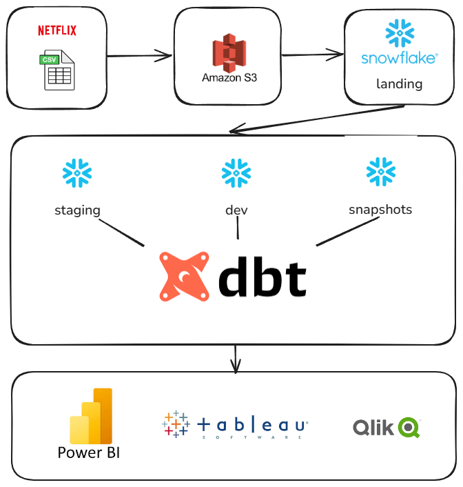

# Netflix-Data-Engineering-Project
An end-to-end data engineering project that builds and manages a Netflix analytics pipeline with dbt, Snowflake, and AWS, including data modeling, transformations, and reporting.
## Architecture

##  Overview  
- **Tutorial-based:** Adapted from a YouTube tutorial on data engineering with dbt, Snowflake, and AWS.  
- **Pipeline Highlights:**  
  - Raw ingestion and staging layers (dbt models)  
  - Dimensional modeling (dim tables and fact tables)  
  - Snapshots to track historical changes  
  - Data testing for quality assurance  
- **Tech Stack:**  
  - **dbt** for modeling & transformations  
  - **Snowflake** as the data warehouse  
  - **AWS** for data storage/processing  
  - **Git/GitHub** for version control and documentation
    
##  Project Structure

```text
netflix-dbt/
├── models/
│   ├── staging/        # source models from raw data
│   ├── dim/            # dimension tables
│   ├── fct/            # fact tables
│   └── snapshots/      # snapshot models
├── seeds/
│   └── genome-tags.csv # static CSV seed file
├── macros/
│   └── custom_key.sql  # custom macro
├── dbt_project.yml     # dbt config
└── README.md           # docs
```

##  Outcomes  

- **Orchestrated raw-to-dimension modeling** using dbt  
- **Applied multiple materializations**, including view, table, and snapshot  
- **Implemented historical tracking** with dbt snapshots  
- **Built robust data testing and documentation layers**  
- **Organized project structure** following analytics engineering best practices

Inspired by Darshil Parmar
